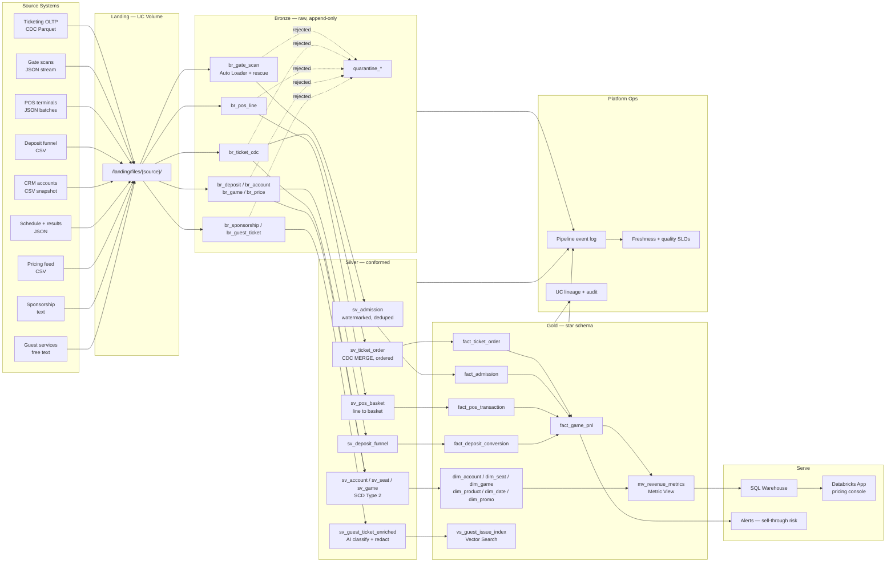

# Kings Ops Lakehouse — Project Charter

**Club:** Las Vegas Kings (fictional MLB expansion franchise)
**Season:** Inaugural — 2027
**Repository:** `neimananalytics/kings-ops-lakehouse`
**Platform:** Databricks Free Edition (serverless), Unity Catalog, Delta Lake, Lakeflow Declarative Pipelines
**Author:** Phil Neiman — NeimanAnalytics.com

> All entities in this project are fabricated. No league, club, or vendor data is used or redistributed.

---

## 1. Business Scenario

The **Las Vegas Kings** play their first Major League season in 2027 at a new 33,000-seat retractable-roof ballpark off the south end of the Strip. The organization is standing up its entire business-intelligence function from nothing, in the one season where it has no history to lean on.

This platform serves the **business side** — ticketing, premium and group sales, concessions, merchandise, parking, sponsorship. Not baseball operations.

### Why an expansion year is the hard version

Every incumbent club prices, staffs, and forecasts off last season. The Kings have no last season. That single fact reshapes the problem:

1. **Cold-start demand forecasting.** There is no "pace versus same date last year." The only forward-looking signal before Opening Day is the **season-ticket deposit funnel** — deposits placed up to 30 months early, converted through priority-ranked seat-selection events. Forecasts must be built from that funnel plus comparable-market priors, then re-anchored game by game as actuals arrive.
2. **Inaugural novelty decay.** Expansion clubs sell out April and sag by August. The decay curve is real, steep, and confounded with team performance and the school calendar. Distinguishing novelty decay from a losing-record effect is the central analytic question of the season, and getting it wrong sets 2028 pricing wrong.
3. **A tourist-majority buyer base.** No other market looks like this. Roughly half of paid attendance originates outside the metro, arriving through hotel bundles, convention group blocks, and same-day walk-up. Tourists show up at a higher rate than local plan-holders, spend substantially more per cap, and buy later. Any model that treats the buyer base as homogeneous will be wrong in both directions at once.
4. **Every system is three months old.** Ticketing, POS, and access control were all commissioned in spring 2027. Terminals are misconfigured, staff are learning the scanners, and sections 118–124 are renumbered in May after sightline complaints. The data is genuinely bad — which is precisely why the quality layer earns its place rather than performing it.

### What the platform delivers

| Outcome | Mechanism |
|---|---|
| Price 81 dates with no historical baseline | Deposit-funnel priors, sell-through velocity, novelty-decay decomposition |
| Staff to attendance, not tickets sold | No-show model segmented by tourist / local / group cohort |
| Protect the 2028 renewal book | Account health score from scan, spend, transfer, and complaint signals |
| Know what the roof costs | Roof-state and climate load joined to per-game operating cost |
| Sponsorship obligations tracked, not litigated | Contract clause extraction and activation reconciliation |

---

## 2. Source Systems

Deliberate heterogeneity — each source forces a different technique, and each is a system a real club operates.

| # | Source | Format / Delivery | Volume (full) | Technique it forces |
|---|---|---|---|---|
| 1 | Ticketing platform | CDC from OLTP, Parquet, `__op` / `__seq` / `__commit_ts` | ~2.4M events | MERGE, **out-of-order events**, duplicates, **refunds landing before their order** |
| 2 | Gate scan stream | JSON, per-gate, per-minute | ~1.9M scans | Auto Loader, Structured Streaming, **40× burst**, **offline handhelds backfilling to 48h**, mid-season schema drift |
| 3 | Concession & merch POS | JSON, per-terminal batches | ~2.6M lines | Late batches, terminal outages, **line → basket grain**, misconfigured tax rates |
| 4 | Deposit & seat-selection funnel | CSV, event-driven | ~38k deposits | **Expansion-only funnel**, priority ranking, conversion and forfeit |
| 5 | CRM / ticket accounts | CSV nightly snapshot | ~44k accounts | **Heavy PII**, visitor origin, **minors on youth-camp rosters** |
| 6 | Game schedule & results | JSON | 81 games | Conformed game dimension, roof state, promo, opponent draw |
| 7 | Dynamic pricing feed | CSV, intraday | ~180k price points | **Effective-dated ranges, overlapping validity** |
| 8 | Sponsorship contracts | Text | ~140 agreements | Clause extraction, AI Functions |
| 9 | Guest services tickets | Parquet, free text | ~31k tickets | AI classification, Vector Search, **PII in free text** |

### The burst problem

Gate scans are not a steady drip. Gates open 90 minutes before first pitch; roughly **60% of a game's scans land in a 25-minute window** starting 40 minutes prior. The pipeline must survive a 40× throughput swing followed by six hours of near-silence.

That is a harder watermarking problem than uniform telemetry, because a watermark tuned for the burst is wrong for the tail. Handheld scanners at the outfield gates lose connectivity and bulk-upload hours later, so **lateness is correlated with gate**, not random — which breaks the assumption most streaming tutorials quietly make.

### The Vegas wrinkle

Attendance splits into three cohorts with different behavior on every axis:

| Cohort | ~Share | Buys | No-show | Per-cap |
|---|---|---|---|---|
| Local plan-holder | 34% | Early, full-season or partial | High (18–24%) | Low |
| Tourist / visitor | 47% | Late, single-game, mobile | Very low (4%) | High |
| Group / convention block | 19% | Very early, bulk | Moderate, block-correlated | Moderate |

Modeling these as one population produces a no-show forecast that is wrong for all three simultaneously. This is the analytic angle that makes the project distinctive.

### Deliberate data defects

Injected on purpose, and in an inaugural season, entirely realistic:

- Duplicate CDC events with identical `__seq`
- **Refund and transfer events landing before the order they reference** — the classic CDC ordering trap
- **Mid-season section renumbering (118–124 → 218–224 in May)** producing orphan seat IDs in earlier orders
- Scans with no matching valid ticket — counterfeit, double-scan, staff badge misread → quarantine
- Scans backdated up to 48h from offline handhelds, clustered by gate
- `scan_device_os` appearing mid-season — schema evolution, not a bug
- Malformed JSON (~0.2% of scans, ~0.1% of POS lines)
- POS terminals dropping entire batches then double-submitting them
- **Two terminals configured with the wrong tax rate for the first three weeks**
- Overlapping effective-date ranges in the pricing feed
- PII embedded in guest-services free text
- Accounts with birth dates indicating minors, requiring separate handling under COPPA-style policy

---

## 3. Architecture



---

## 4. Dimensional Model (Gold)

**Grain statements — write these down, interviewers ask.**

| Table | Grain | Type |
|---|---|---|
| `fact_ticket_order` | One row per seat per order line, current state | Accumulating snapshot |
| `fact_ticket_event` | One row per order state transition | Transaction |
| `fact_admission` | One row per validated scan | Transaction |
| `fact_pos_transaction` | One row per POS line item | Transaction |
| `fact_deposit_conversion` | One row per deposit, accumulating through selection | Accumulating snapshot |
| `fact_price_point` | One row per seat-class per game per effective window | Effective-dated |
| `fact_game_pnl` | One row per game | Periodic snapshot |
| `dim_account` | One row per account per version | SCD Type 2 (PII-bearing) |
| `dim_seat` | One row per seat per version | SCD Type 2 (**renumbering event in May**) |
| `dim_game` | One row per game | Type 1, late-arriving result attributes |
| `dim_product` | One row per SKU per price period | SCD Type 2 |
| `dim_promo` | One row per promotion | Type 1 |
| `dim_date` | One row per calendar date | Static |

### Headline metrics

- **Sell-through %** and **velocity** — against deposit-funnel priors, not prior-year
- **No-show rate** — segmented by cohort; the aggregate number is actively misleading here
- **Per-cap spend** — POS revenue ÷ *validated admissions*. The denominator is the point: most clubs use tickets sold and understate it by 12–22%
- **Price realization** — average sale price ÷ face, by section and days-to-game
- **Novelty decay index** — attendance residual after controlling for opponent, day-of-week, promo, and record
- **Deposit conversion rate** — deposits → seat selections → renewals-intent
- **Account health score** — scan rate, spend trend, transfer-without-use, open complaints

---

## 5. Tranche Roadmap

Each tranche is one PR with an ADR. CI/CD moves to the front, because building it fourth means retrofitting environment parameterization into three tranches of existing code.

| Tranche | Scope | Original project |
|---|---|---|
| **T0** | Repo, bundle skeleton, UC layout, synthetic generator, landing volumes | foundation |
| **T1** | CI/CD spine: bundle targets, pytest, GitHub Actions gates | P4 (moved up) |
| **T2** | Bronze ingestion: Auto Loader, contracts, schema evolution, quarantine | P1 |
| **T3** | Silver batch: CDC MERGE with ordering guarantees, SCD2, expectations | P1 |
| **T4** | Silver streaming: gate scans, burst handling, watermarking, late data | P5 |
| **T5** | Gold star schema, Metric Views, liquid clustering, file layout | P3 |
| **T6** | Governance: tags, column masks, row filters, minor handling, lineage | P2 |
| **T7** | Observability: event log analytics, freshness SLOs, alerting, recovery | P6 |
| **T8** | Document intelligence: contract clauses, guest-issue Vector Search | P7 |
| **T9** | Databricks App: pricing console over gold | new |
| **T10** | Packaging: README, case study, LinkedIn article, screenshots, interview prep | — |

---

## 6. Modern Capabilities Worth Building In

Available on Free Edition, and almost no portfolio demonstrates them:

- **Lakebase** (one project per account) — managed Postgres OLTP inside Databricks. Run the actual ticketing operational store here and emit real CDC from it rather than simulating it with files. More credible, and new enough that most interviewers have not seen it demonstrated.
- **Unity Catalog Metric Views** — a governed semantic layer so "no-show rate" has one definition across the App, the warehouse, and BI. Directly transferable to your Power BI background.
- **Databricks Apps** (up to 3 per account) — the T9 pricing console, where your front-end work becomes a data-engineering differentiator.
- **AI Functions** for clause extraction and guest-issue classification, over hand-rolled embed-and-retrieve.

---

## 7. Free Edition Constraints → Architectural Decisions

### ADR-001 — Environment isolation by catalog, not by workspace
One workspace and one metastore per account means dev/stg/prd are **catalogs** (`kings_dev`, `kings_stg`, `kings_prd`) inside a single metastore, with bundle targets parameterizing catalog and schema. Present it as a deliberate choice with a stated migration path — not a wall you hit.

### ADR-002 — Performance measured by query plan, not wall clock
Serverless offers no cluster sizing, no Photon toggle (serverless is always Photon), and one 2X-Small warehouse under a fair-usage quota. Wall-clock benchmarks there are noise and an experienced interviewer will know it. Measure **files pruned, bytes scanned, partitions skipped** from the query profile and Delta statistics. State the constraint in the README.

### ADR-003 — Pipeline concurrency budget
One active pipeline per pipeline type, five concurrent job tasks maximum. Batch and streaming are scheduled rather than co-resident, with an explicit documented budget.

### ADR-004 — Vector Search via Delta Sync index
One AI Search endpoint, one search unit, no Direct Vector Access. The guest-issue index is a **Delta Sync index** over the gold table — the better pattern regardless, since it stays lineage-tracked in UC.

### Setup prerequisites
1. **Verify with LinkedIn** — Free Edition restricts outbound internet access until you do.
2. Free Edition may not be used for commercial purposes. Job-search portfolio, yes; client or consulting demo assets, no.
3. **Synthetic data only.** Club, ballpark, schedule, and opponents are fabricated. Real league data carries redistribution terms and a public repo is publication.

---

## 8. Repository Layout

```
kings-ops-lakehouse/
├── README.md
├── databricks.yml
├── pyproject.toml
├── conf/
│   ├── base.yml  dev.yml  stg.yml  prd.yml
├── resources/
│   ├── pipelines/  jobs/  schemas/
├── src/kings_ops/
│   ├── config.py  logging_utils.py
│   ├── contracts/  io/  quality/  observability/
│   └── transforms/          # PURE functions — the unit-tested core
├── pipelines/bronze|silver|gold/
├── sql/ddl|governance|marts|monitoring/
├── tests/unit|integration/
├── tools/generate_source_data.py
├── app/                     # T9 Databricks App
├── docs/adr|architecture|case-study/
└── .github/workflows/
```

**Design note on `transforms/`:** every business transformation is a pure function taking and returning a DataFrame — no session construction, no reads, no writes inside. Notebooks and pipeline files are thin wrappers. This is what makes the codebase unit-testable without a cluster, and it is the thing most portfolio repos get wrong.

---

## 9. What Makes This Portfolio-Grade

- **Unit tests on transformation logic**, not just pipeline expectations
- **Data contracts** at the bronze boundary with a documented breaking-change policy
- **A CI gate that can fail** — leave a red build in the history and the PR that fixed it
- **An ADR trail** documenting rejected alternatives, not only chosen ones
- **A cost model** — estimated DBU per layer per run. Nearly no portfolio has this, and every architect interview asks about cost.
